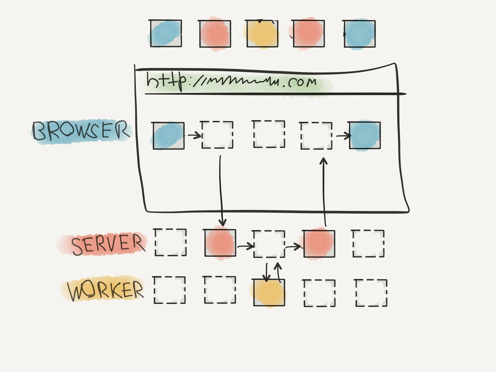
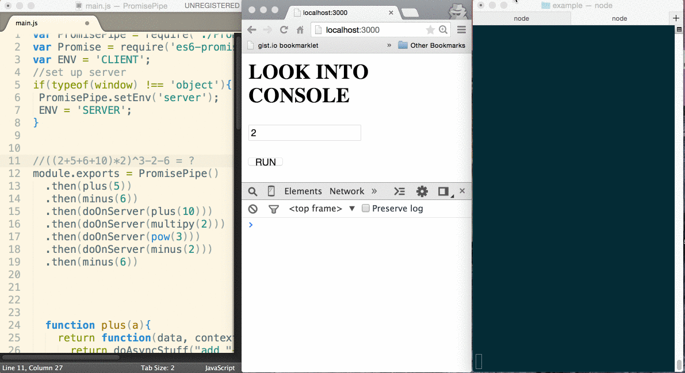
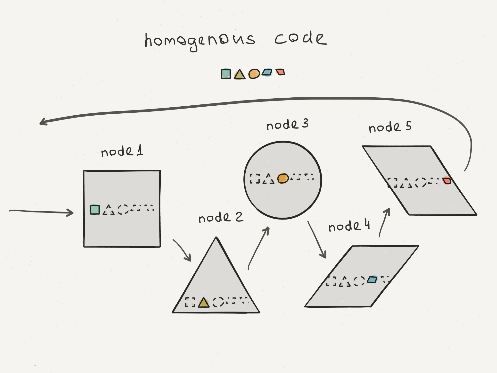

Когдато я был бекенд разработчиком, а до этого я занимался фронтендом. Я думаю что я был неплохим бекендом для моих фронтенд коллег, т.к. я думал об API с точки зрения его использования.

Мне как фронтенд разработчику везло меньше. Создание API - это сложно. Сформировать общее понимание того каким должно быть взаимодействие клиента с сервером, забирает много времени и энергии. Мы начинаем с REST API, но у каждого свое понимание того, что такое REST, затем каждая модификация API требует усилий, времени и долгих обсуждений.

Сейчас для описании запросов ресурсов с сервера, я использую Промисы. Мне они симпатичны, поскольку у них удобное chaining API для потенциально асинхронной бизнеслогики.

Я думаю, что любую бизнеслогику можно представить как цепочку преобразований данных. К примеру, сохранение объекта в базу данных - это преобразование данных в идентификатор объекта в базе данных.

Давай посмотрим код простой бизнеслогики построеной на Промисах:

```javascript
Promise.resolve(item)
  .then(validateItem)
  .then(postItem)
  .then(addItem)
  .catch(handleError)
```

`postItem` возвращает Промис который будет выполнен когда придет ответ с сервера.

На стороне сервера скорее всего у нас будет такой nodejs/express код:

```javascript
app.post('/api/items',
  validateItemMiddleware,
  saveItemInDBMiddleware,
  returnItemMiddleware)
```
Я думаю что еслибы Промисы появились раньше - [@tjholowaychuk](https://twitter.com/tjholowaychuk) бы использовал их в expressjs вместо middleware функций.

На Промисах, сервер бы наверное выглядел как-то так:
```javascript
app.post('/api/items')
  .then(validateItem)
  .then(saveItemInDB)
  .then(returnItem)
```
Поскольку любой Промис можно составить из других Промисов, давай на секунду представим что у нас нет разделения на фронтенд и бекенд, тогда наш код будет выглядеть так:

```javascript
var postItem = function(data){
  return Promise.resolve(data)
    .then(validateItem)
    .then(saveItemInDB)
    .then(returnItem)
}

Promise.resolve(item)
  .then(validateItem)
  .then(postItem)
  .then(addItem)
  .catch(handleError)
```
Ясно-понятно что в этом случае нам не нужно будет АПИ и мы не будем тратить время на обсуждение как назвать путь и какой выбрать метод в данном случае.

Если пойти еще дальше, то наш код можно сделать более плоским:

```javascript
Promise.resolve(item)
  .then(validateItem)
  .then(validateItemServer)
  .then(saveItemInDB)
  .then(addItem)
  .catch(handleError)
```
Конечно с простыми Промисами нам этого не сделать, но можно сделать с
[PromisePipe](https://github.com/edjafarov/PromisePipe).

PromisePipe это конструктор переиспользуемых цепочек промисов. И так как у ПромисПайпа больше контроля над выполнением цепочки, можно контролировать и модифицировать исполнение каждого звена.

ПромисПайп это синглтон. Можно строить гомогенные цепочки бизнеслогки и запускать паралельно на клиенте и сервере. Звенья, помеченые как серверные, будут выполняться на сервере, а клиентские на клиенте. В ПромисПайпе нужно имплементировать методы которые будут прокидывать сообщения между клиентом и сервером. Причем, можно использовать любые транспорты котороые могут пересылать сообщения.




Итак, нужно будет написать немного кода который будет прокидывать эти сообщения. Посмотреть примеры можно [тут](https://github.com/edjafarov/PromisePipe/tree/master/example/simple). Пока я в основном использовал [socket.io](http://socket.io/) как транспорт, но не должно быть проблем с простыми HTTP или любым другим протоколом который может пересылать сообщения.



C ПромисПайп бизнеслогика будет выглядеть примерно так:

```javascript
var doOnServer = PromisePipe.in('server')
var addItemAction = PromisePipe()
  .then(validateItem)
  .then(doOnServer(validateItemServer))
  .then(doOnServer(saveItemInDB))
  .then(addItem)
  .catch(handleError);
addItemAction(item) // will pass complete chain
```
Когда выполнение цепочки подходит к  `validateItemServer` ПромисПайп перекидывает исполнение на сервер с помошью специального сообщения. `validateItemServer` и `saveItemInDB` выполняются на сервере и сообщение отсылается назад для продолжение выполнения на клиенте начиная с `addItem`.

В ПромисПайпе можно расширять API своими методами, что дает построить API так что оно максимально удобно опишет бизнеслогику:

```javascript
var doOnServer = PromisePipe.in('server')
var addItemAction = PromisePipe()
  .validate('item')
  .validateServer('item')
  .db.save.Item()
  .then(addItem)
  .catch(handleError);
addItemAction(item) // will pass complete chain
```

Например вот [mongodb API](https://github.com/edjafarov/mongo-pipe-api)  для ПромисПайп. А вот пример [todo-app](https://github.com/edjafarov/PromisePipe/tree/master/example/mongotodo)([live](bit.ly/promisepipe-todo )) приложения которое использует  "mongo-pipe-api". `validateServer` и "mongo-pipe-api" должны быть помечены как серверные методы. И тогда эти звенья будут выполняться на сервере.

С ПромисПайп можно строить бизнеслогику с помощью цепочек простых трансформаций которые способны выполняться в разных процессах в то время как логика остается простой и гомогенной.

С ПромисПайп мы получаем:
* **простоту**

	Строим логику в функциональном стиле используя простые трансформации данных. Забываем о межпроцессных взаимодействиях и концентрируемся на бизнеслогике.

* **тестируемость**

	Каждое звено можем тестировать отдельно. Так же просто склеиваем звенья в цепочки и теструем целые куски функциональности изолировано.

* **изоморфизм**

	ПромисПайп созданы для работы в межпроцессных средах. Значит мы получаем изоморфную бизнеслогику из коробки если создаем звенья изоморфными. Так, если не использовать API специфичного для среды то можно запускать пайп как в одном процессе так и ожидать что цепочка будет работать в среде браузер+сервер.

* **масштабирование**

  Каждое звено может запускаться в своем отдельном процессе без больших усилий. Это не значит пока что мы получаем масштабируемость из коробки, но значит что у нас есть довольно простой метод распределения нагрузки между многими процессами.

* **фронтендеры могу полностью описывать бизнеслогику**

    Цепочки и звенья легко стыкуются друг с другом. Основная идея - позволить фронтенд разработчику используя простые функциональные кирпичики строить бекенд, инкапсулируя сложность внутри осмысленных звений бизнеслогики.



Я думаю что ПромисПайп поможет в создании микросервисных архитектур. Гомогенная бизнесолгика позволяет отделить логику от межпроцессного взаимодействия, стирая разницу между кодом монолитной и микросервисной архитектур.
